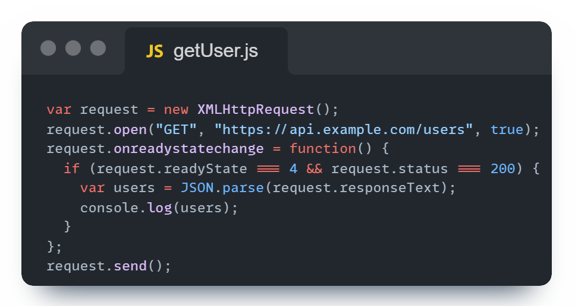
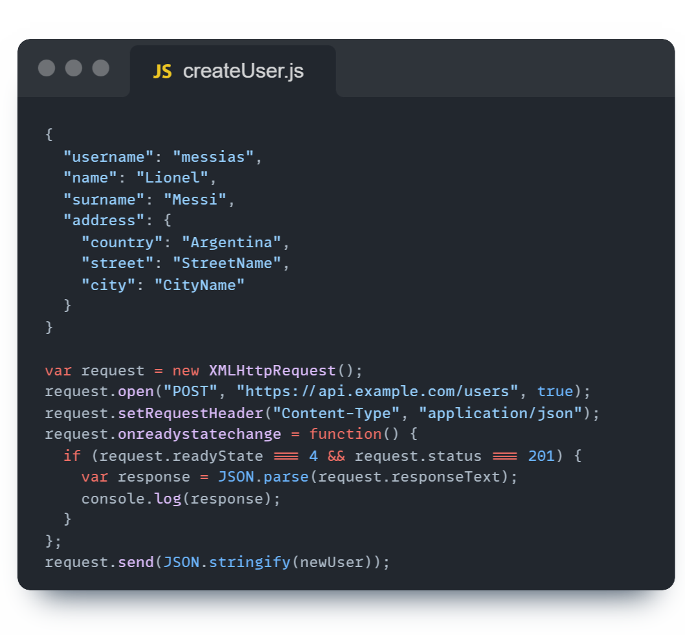
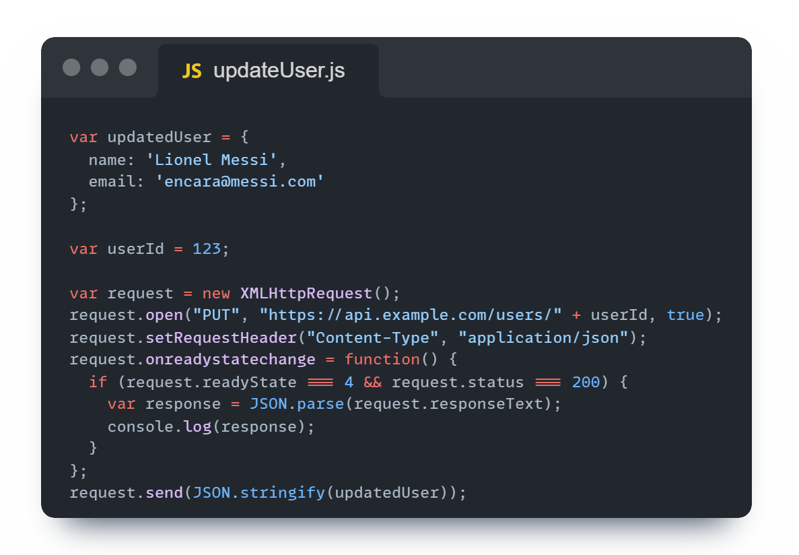
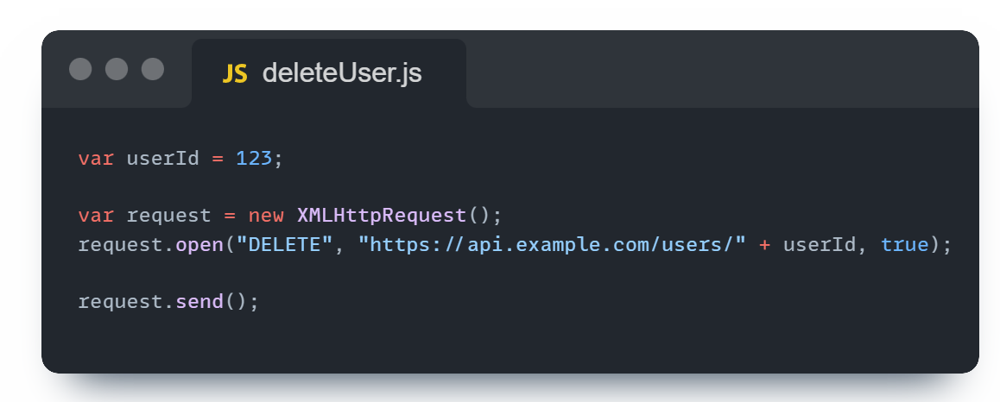

# TECNOLOGIA REST

- [REST](#REST) 

- [Endpoints y CRUD](#Endpoints-y-CRUD)

- [Header HTTP](#Header-HTTP)

- [Body HTTP](#Body-HTTP)

- [Métodos HTTP](#Métodos-HTTP)

- [Respuesta HTTP](#Respuesta-HTTP)

- [Cómo hacer una solicitud con Node](#Solicitud-con-Node.js-`axios`) 

- [Cómo hacer una solicitud con "fetch"](#Solicitud-con-`fetch`) 

- [Propuesta de ejercicio](#Ejercicio-práctico) 

## REST  

REST (Representational State Transfer) es un estilo arquitectónico para definir servicios web que sean simples, escalables y eficientes. En el contexto de la web, REST utiliza URIs (Identificadores de Recursos Uniformes) para identificar recursos y el protocolo HTTP para realizar llamadas sobre esos recursos(GET, POST, PUT y DELETE,principalmente). Esto permite una comunicación cliente-servidor donde el cliente puede solicitar y manipular datos al servidor de manera uniforme. 


Resumiendo, REST sería la tecnología con la que vamos a desarrollar las APIs que estén preparadas para recibir las solicitudes que necesitemos.

## Endpoints y CRUD

En una API de lista de tareas, los **endpoints** son identificadores que representan diferentes recursos y operaciones que se pueden realizar en la API. Estos también involucran el **CRUD** (_Create Read Update Delete_), que son las operaciones básicas para gestionar los datos de los recursos. Aquí hay algunos ejemplos comunes de endpoints en una API de lista de tareas:


- `/tareas/{id}` (PUT / DELETE): Endpoint para obtener, actualizar o eliminar una tarea específica, donde `{id}` es el identificador único de la tarea.

Los endpoints son la interfaz principal a través de la cual los clientes interactúan con una API REST, y proporcionan una forma estructurada y uniforme de acceder y manipular recursos en el servidor.

#### LEER (_GET_)

 `/tareas`: Endpoint para obtener todas las tareas.



#### CREAR (_POST_)

 `/tareas/{id}`: Endpoint para agregar una nueva tarea.



#### MODIFICAR (_PUT_/_FETCH_)



 `/tareas/{id}`: Endpoint para modificar total o parcialmente una tarea.

#### ELIMINAR (_DELETE_)



 `/tareas/{id}`: Endpoint para eliminar una tarea.

## Header HTTP
Son componentes que se intercambian cliente y servidor. Proporcionan información sobre los datos que están recibiendo o enviando.
#### Solicitud
Se envian por parte del cliente al servidor
- **Accept** - Indica el formato de respuesta que recibirá _aplication/json_
- **Content-Type** - Indica el formato de los datos que está enviando el cliente _aplication/json_
- **Authorization** - Sirve para enviar las credenciales de autentificación del servidor.
#### Respuesta
Se envian por parte del servidor al cliente
- **Status** - Indica el estado de la solicitud
- **Content-Type** - Indica el formato de los datos que se le estan enviando al cliente _aplication/json_

## Body HTTP
El cuerpo (body) de una solicitud HTTP contiene datos adicionales enviados al servidor, como parámetros de formulario o carga útil de JSON.

#### form-data
En este formato, los datos se envían como pares clave-valor, similar a cómo se envían los datos de un formulario HTML. Es útil para enviar archivos binarios junto con otros datos de formulario.

```plaintext
Nombre: Juan
Email: juan@example.com
Archivo: [archivo adjunto]
```

#### x-www-form-urlencoded
En este formato, los datos se envían como una cadena de consulta codificada en URL, donde los valores están codificados en formato clave=valor y separados por "&". Es útil para enviar datos de formulario simples.

```plaintext
nombre=Juan&email=juan%40example.com
```

#### raw
En este formato, los datos se envían en su forma bruta, sin ningún tipo de codificación adicional. Se puede usar para enviar datos en formato JSON, XML u otros formatos de carga útil personalizados. Es útil cuando se necesita control total sobre el formato de los datos enviados.

```json
{
  "nombre": "Juan",
  "email": "juan@example.com"
}

```

## Métodos HTTP

- **GET**: Recupera una información para el cliente.
```bash
GET /api/users
```

```bash
GET /api/users/{id}
```
- **POST**: Crea un recurso dentro del servidor. (Agrega un registro en) (Agregar un registre a la base de dades)

```bash
POST /api/users
Content-Type: application/json

{
  "nombre": "Example",
  "email": "ejemplo@example.com",
  "edad": 30
}
```
- **PUT**: Actualiza un recurso ya existente dentro del servidor.
```bash
POST /api/users/{id}
Content-Type: application/json

{
  "nombre": "Example",
  "email": "ejemplo@example.com",
  "edad": 30
}
```
- **PATCH**: Actualiza un campo sin tener que rreemplazarlo entero

```bash
PATCH /api/users/{id}
Content-Type: application/json

{
  "nombre": "Example v2",
}
  ```
- **DELETE**: Elimina un recurs.
```bash
DELETE /api/users/{id}
```

## Respuesta HTTP
Son las respuestas que da la pagina para informar sobre el resultado de la operación:

- **200** - OK
- **201** - Created
- **204** - No Content
- **400** - Bad Request
- **401** - Unauthorized
- **403** - Forbidden
- **404** - Not Found
- **500** - Internal Server Error


## Solicitud con Node.js `axios`

#### GET:
```javascript
const axios = require('axios');

axios.get('https://api.example.com/users')
  .then(response => {
    console.log(response.data);
  })
  .catch(error => {
    console.error('Error fetching data:', error);
  });
```

#### POST:
```javascript
const axios = require('axios');

axios.post('https://api.example.com/users', {
    name: 'John Doe',
    email: 'john@example.com',
    age: 30
  })
  .then(response => {
    console.log('User created:', response.data);
  })
  .catch(error => {
    console.error('Error creating user:', error);
  });
```

#### PUT:
```javascript
const axios = require('axios');

axios.put('https://api.example.com/users/123', {
    name: 'John Doe',
    email: 'john@example.com',
    age: 35
  })
  .then(response => {
    console.log('User updated:', response.data);
  })
  .catch(error => {
    console.error('Error updating user:', error);
  });
```

#### DELETE:
```javascript
const axios = require('axios');

axios.delete('https://api.example.com/users/123')
  .then(response => {
    console.log('User deleted:', response.data);
  })
  .catch(error => {
    console.error('Error deleting user:', error);
  });
```


## Solicitud con `fetch`: 

#### GET:
```javascript
fetch('https://api.example.com/users')
  .then(response => response.json())
  .then(data => console.log(data))
  .catch(error => console.error('Error fetching data:', error));
```

#### POST:
```javascript
fetch('https://api.example.com/users', {
    method: 'POST',
    headers: {
      'Content-Type': 'application/json'
    },
    body: JSON.stringify({
      name: 'John Doe',
      email: 'john@example.com',
      age: 30
    })
  })
  .then(response => response.json())
  .then(data => console.log('User created:', data))
  .catch(error => console.error('Error creating user:', error));
```

#### PUT:
```javascript
fetch('https://api.example.com/users/123', {
    method: 'PUT',
    headers: {
      'Content-Type': 'application/json'
    },
    body: JSON.stringify({
      name: 'John Doe',
      email: 'john@example.com',
      age: 35
    })
  })
  .then(response => response.json())
  .then(data => console.log('User updated:', data))
  .catch(error => console.error('Error updating user:', error));
```

#### DELETE:
```javascript
fetch('https://api.example.com/users/123', {
    method: 'DELETE'
  })
  .then(response => console.log('User deleted:', response.status === 204 ? 'Successful' : 'Failed'))
  .catch(error => console.error('Error deleting user:', error));
```

# Ejercicio práctico

## Objetivo
Familiarizarse con las solicitudes HTTP GET, POST, PUT i DELETE utilizando Node.js i la función `fetch()`.
## Enunciado

1. Obtener usuarios (GET):
	1.1 Haz la consulta necesaria para conseguir todos los _posts_
		- Imprime por consola el estado de la consulta y si devuelve alguna cosa
	
	1.2 Haz la consulta necesaria para conseguir el _post_ con _ID_ 1
		- Imprime por consola el estado de la consulta y si devuelve alguna cosa.

2. Agregar usuario (POST):
	- Crea un nuevo _post_: 
		- _userId_ = 1
		- _title_ = "Nombre y apellido" 
		- _body_ = "Esto es un post de prueba"
	- Imprime por consola el estado de la consulta y si devuelve alguna cosa.
	
3. Actualitzar usuario (PUT):
	-  Actualiza los datos del _post_ con _ID_ 1: 
		- _title_ = "Apellido y Nombre" 
		- _body_ = "Este es un post actualizado"
	- Imprime por consola el estado de la consulta y si devuelve alguna cosa.

4. Eliminar usuario (DELETE):
	- Elimina el usuario con _ID_ 1
	- Imprime por consola el estado de la consulta y si devuelve alguna cosa.

## Eines
- **Aplicaciones**: Para poder realizar este ejercicio se tendrá que hacer uso de de uno de los plugins mencionados anteriormente, o de sus respectivas aplicaciones.

- **API**: la API necesaria para poder hacer los ejercicios es la siguiente:
	https://jsonplaceholder.typicode.com/posts/